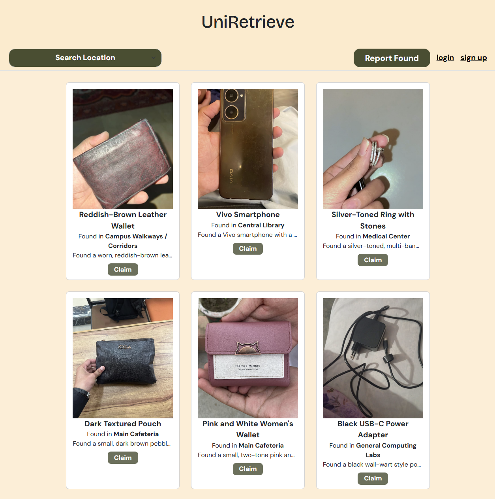
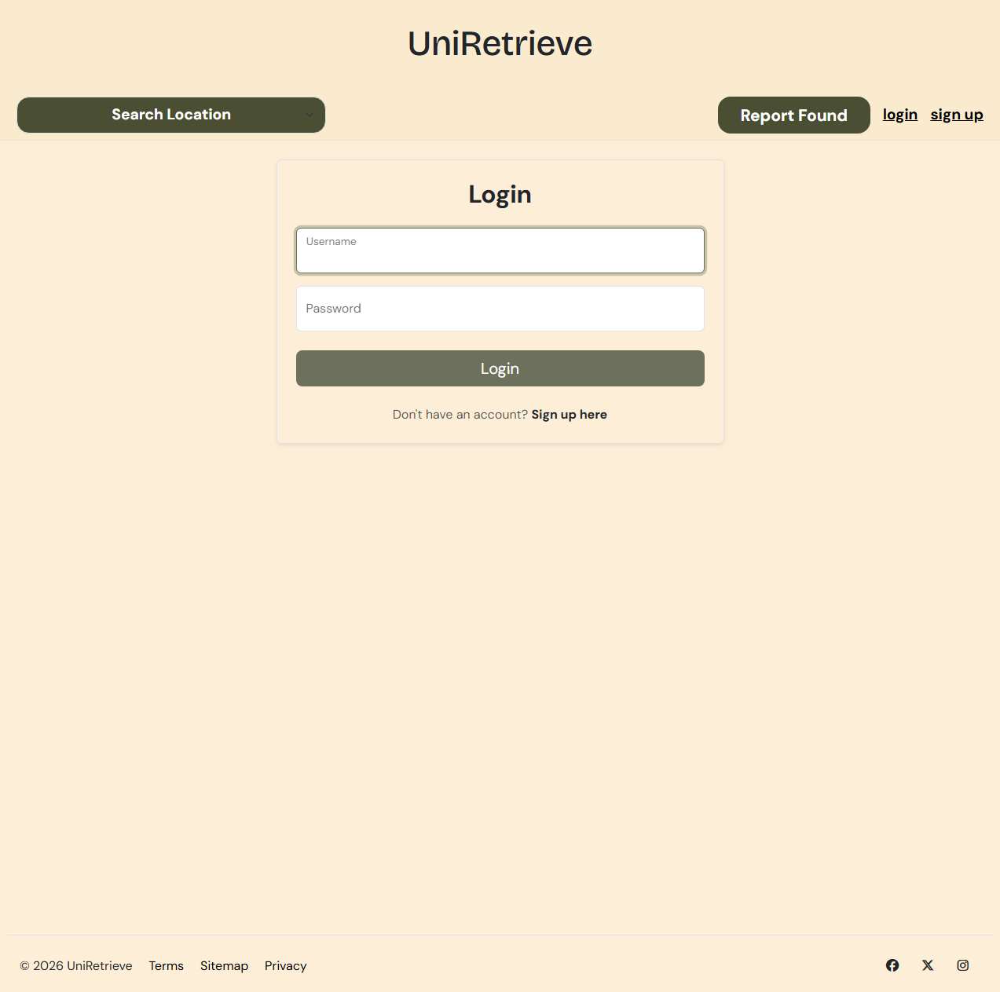
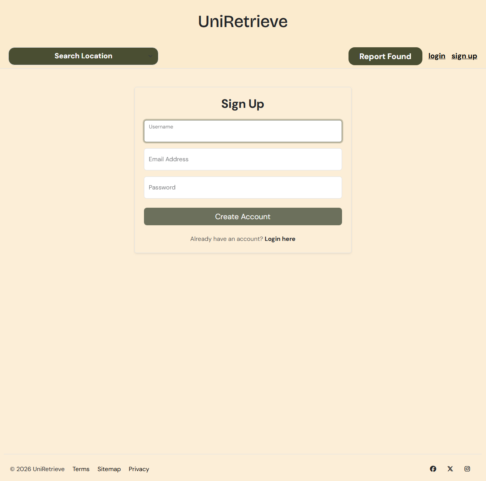
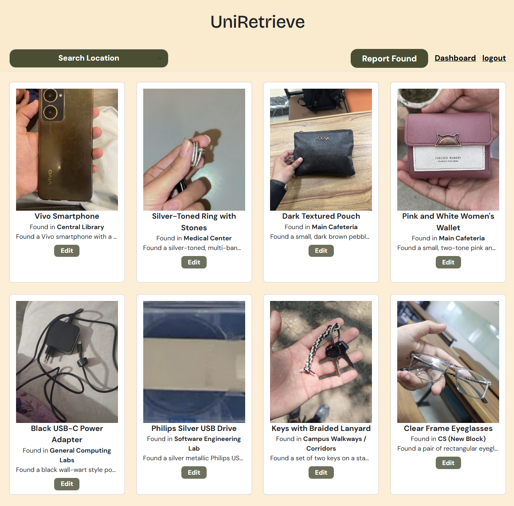
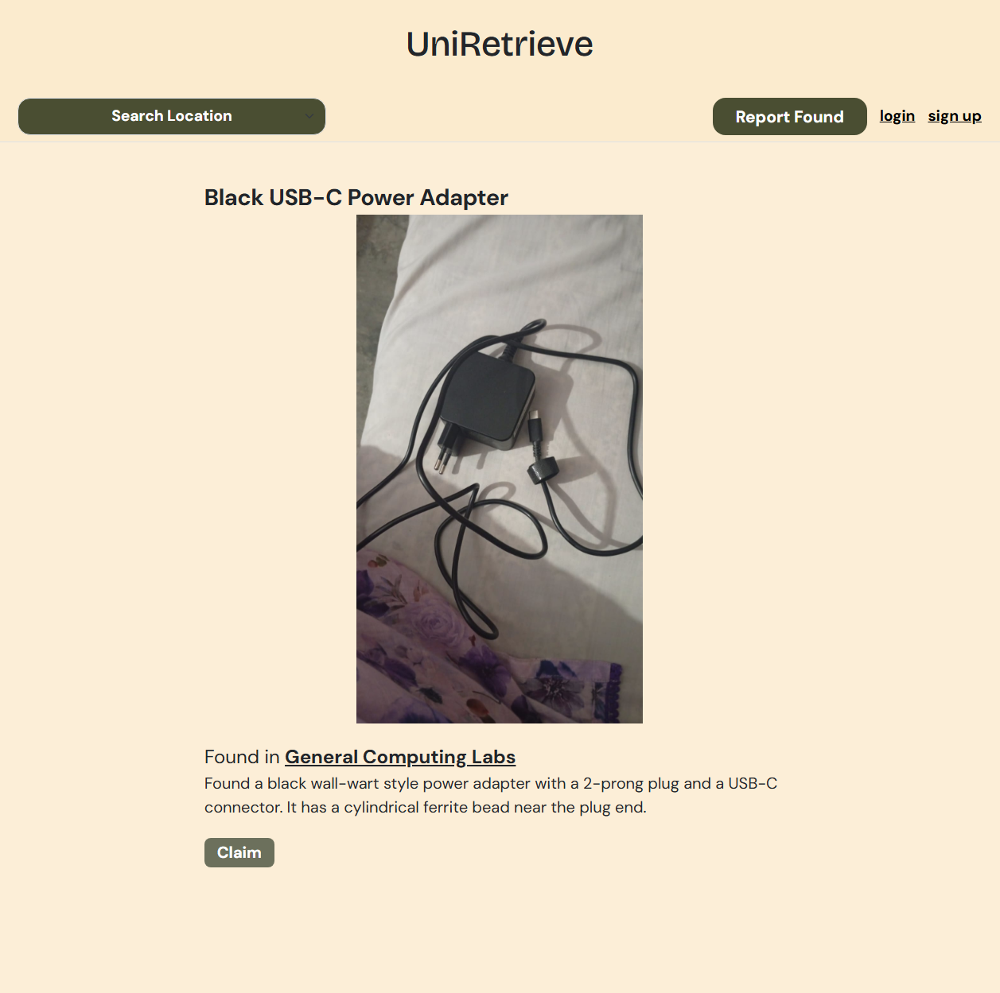
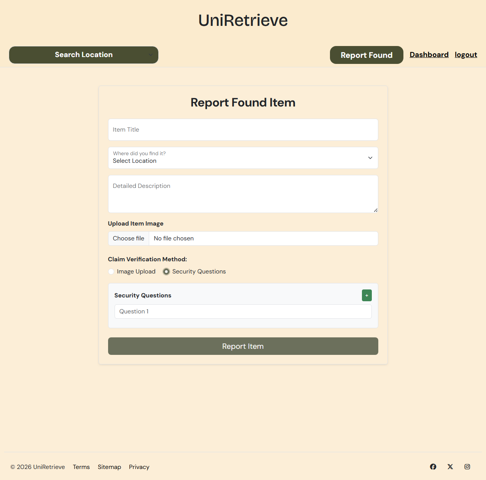

# UniRetrieve

UniRetrieve is a centralized campus lost-and-found web application designed to help students, staff, and campus members report, search, and claim lost items more efficiently.

The platform allows users to report found items, upload item images, add verification questions, browse available lost-and-found listings, filter items by location, and submit ownership claims. It is built using Node.js, Express.js, MongoDB, EJS, Passport.js, and Cloudinary.

## Features

- User registration and login
- Secure password validation using bcrypt
- Session-based authentication using Passport.js
- Report found items with title, description, location, image, and verification questions
- Browse all reported lost-and-found items
- Filter items by campus location
- View detailed item information
- Submit ownership claims for reported items
- Upload item and claim images using Cloudinary
- Edit and delete reported items
- Reporter-only item management
- Claim restriction so reporters cannot claim their own reported items
- Dashboard for viewing items reported by the logged-in user
- Flash messages for success and error feedback
- Sample data support for development and testing
- Custom error handling for invalid routes and server errors

## Tech Stack

### Backend

- Node.js
- Express.js
- MongoDB
- Mongoose
- Passport.js
- Passport Local
- bcrypt
- Express Session
- Connect Mongo
- Method Override
- dotenv

### Frontend

- EJS
- EJS Mate
- CSS
- JavaScript

### Image Uploads

- Multer
- Cloudinary
- Multer Storage Cloudinary

## Project Structure

```text
UniRetrieve/
├── Sample_Data/
│   └── data.js
├── controllers/
│   ├── claimctrl.js
│   ├── itemctrl.js
│   └── userctrl.js
├── models/
│   ├── claims.js
│   ├── items.js
│   └── users.js
├── public/
├── routers/
│   ├── claims.js
│   ├── items.js
│   └── users.js
├── utilities/
│   ├── ExpressError.js
│   └── WrapAsync.js
├── views/
├── .env.example
├── .gitignore
├── Cloud_Config.js
├── app.js
├── middlewares.js
├── package-lock.json
├── package.json
└── README.md
```

## Installation

### 1. Clone the Repository

```bash
git clone https://github.com/hammadem/UniRetrieve.git
cd UniRetrieve
```

### 2. Install Dependencies

```bash
npm install
```

### 3. Create Environment Variables

Create a `.env` file in the root directory and add the required environment variables.

```env
MONGO_URL=your_mongodb_connection_string
SESSION_SECRET=your_session_secret
CLOUDINARY_NAME=your_cloudinary_cloud_name
CLOUDINARY_API=your_cloudinary_api_key
CLOUDINARY_SECRET=your_cloudinary_api_secret
```

Important: never upload your real `.env` file to GitHub. Keep sensitive credentials private.

### 4. Run the Application

```bash
node app.js
```

Or use nodemon during development:

```bash
npx nodemon app.js
```

The application will run locally at:

```text
http://localhost:8080
```

## Environment Variables

| Variable | Description |
|---|---|
| `MONGO_URL` | MongoDB database connection string |
| `SESSION_SECRET` | Secret key used for session security |
| `CLOUDINARY_NAME` | Cloudinary cloud name |
| `CLOUDINARY_API` | Cloudinary API key |
| `CLOUDINARY_SECRET` | Cloudinary API secret |

## Main Routes

### General Routes

| Route | Method | Description |
|---|---|---|
| `/` | GET | Redirects users to `/items` |
| `/dashboard` | GET | Displays items reported by the logged-in user |
| `/sample` | GET | Loads predefined sample data into the database |

### User Routes

| Route | Method | Description |
|---|---|---|
| `/signup` | GET | Render signup page |
| `/signup` | POST | Register a new user |
| `/login` | GET | Render login page |
| `/login` | POST | Authenticate and log in user |
| `/logout` | POST | Log out current user |

### Item Routes

| Route | Method | Description |
|---|---|---|
| `/items` | GET | Display all reported items |
| `/items` | POST | Create a new item report |
| `/items/location` | GET | Filter items by location |
| `/items/report` | GET | Render report item form |
| `/items/:id` | GET | View details of a specific item |
| `/items/:id/edit` | GET | Render edit item form |
| `/items/:id` | PATCH | Update an item |
| `/items/:id` | DELETE | Delete an item |

### Claim Routes

| Route | Method | Description |
|---|---|---|
| `/items/:id/claim` | GET | Render claim form for a specific item |
| `/items/:id/claim` | POST | Submit ownership claim for a specific item |

## How It Works

1. A user signs up or logs in.
2. The logged-in user reports a found item by entering item details, location, image, and verification questions.
3. Other users can browse all reported items.
4. Users can filter items by campus location.
5. If someone believes an item belongs to them, they can submit a claim.
6. The claim may include contact details, answers to verification questions, an explanation, and image proof.
7. The item reporter can manage their own reported items from the dashboard.
8. The reporter can edit or delete only the items they originally reported.

## Screenshots

### Homepage



### Login Page



### Signup Page



### Dashboard



### Item Details Page



### Claim Form



## Sample Data

The project includes sample lost-and-found item data inside the `Sample_Data` folder.

A sample route is available:

```text
/sample
```

This route can be used to load predefined sample items into the database for development and testing.

Use this route carefully because it may remove or overwrite existing test data depending on how the sample data function is configured.

## Security Notes

- Passwords are validated securely using bcrypt.
- Authentication is handled using Passport.js local strategy.
- Sessions are stored using MongoDB through Connect Mongo.
- Protected routes require users to be logged in.
- Only the original item reporter can edit or delete their own reported item.
- Reporters are restricted from claiming their own reported items.
- Environment variables should be stored in `.env`.
- The `.env` file should not be committed to GitHub.

## Known Development Notes

This project is currently under development. Some features may require additional testing, validation, and refinement before production deployment.

## Author

Developed by [hammadem](https://github.com/hammadem)

## Repository

GitHub Repository: [UniRetrieve](https://github.com/hammadem/UniRetrieve)

## License

This project is licensed under the MIT License. See the [LICENSE](LICENSE) file for details.